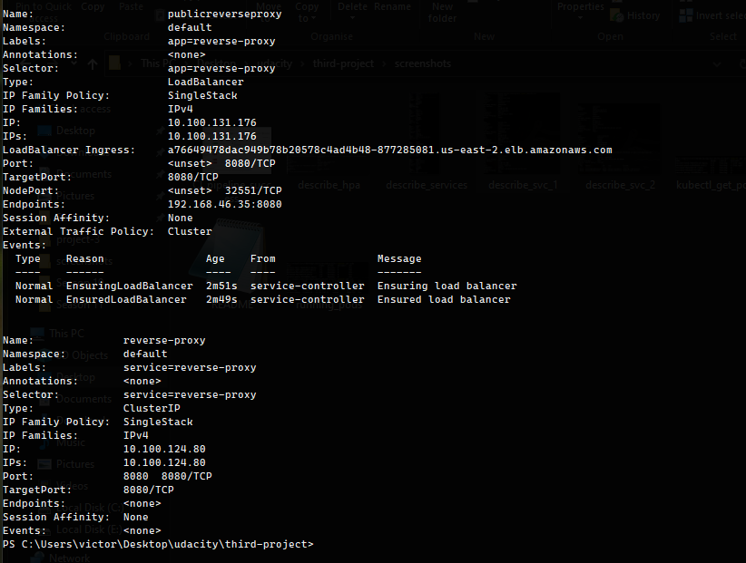
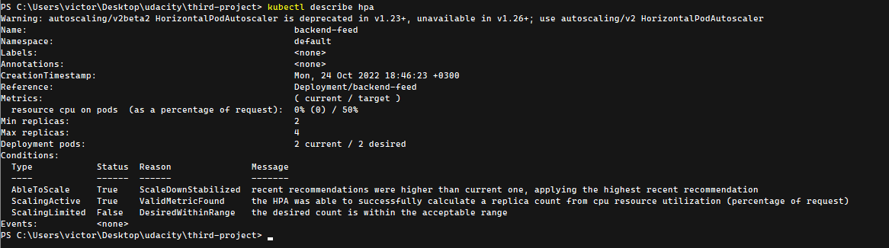
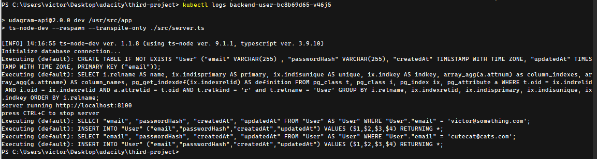

# Project 3 [Udacity Nanodegree]
In this project, you had to refactor a large monolithic application into microservices and then deploy it to an EKS Cluster.

## Screenshots
To help review the provisioned K8s cluster and related resources

### Deployment Pipeline
* DockerHub showing containers that you have pushed


* GitHub repository’s settings showing a CircleCI webhook


* CircleCI showing a successful build and deploy job


### Kubernetes
* Verifies Kubernetes pods are deployed properly
```bash
kubectl get pods
```


* Verifies Kubernetes services are properly set up
```bash
kubectl describe services
```




* Verifies that horizontal scaling is set against CPU usage
P.S. a metrics server had to be installed
```bash
kubectl describe hpa
```


### Activity Logging
* Verifies logging is set up with a backend application
```bash
kubectl logs {pod_name}
```



## Successful Deployment
* Screenshots showing interaction with the app


